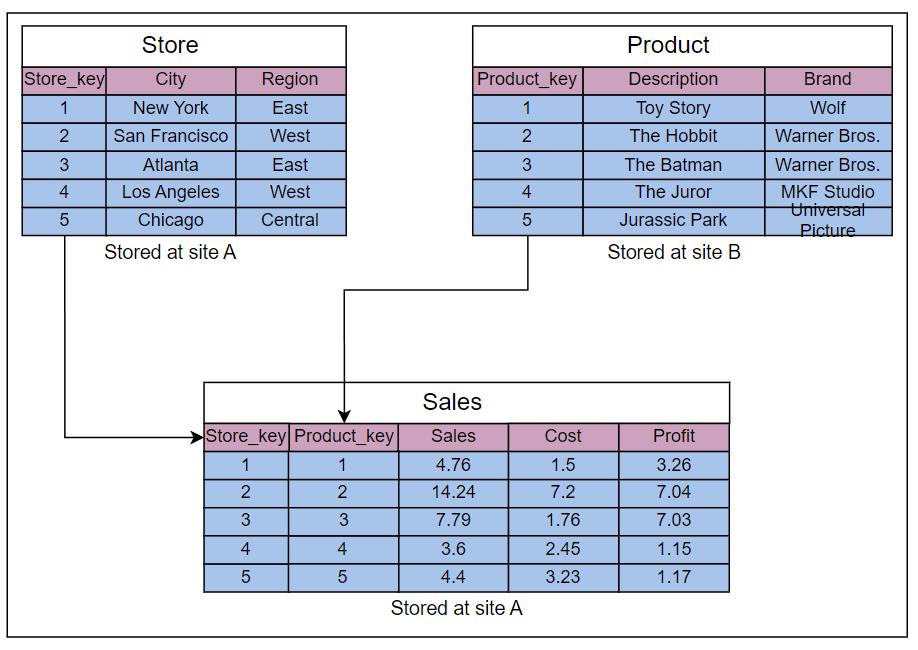

# 数据库中的权衡

学习何时使用水平分片而不是垂直分片，反之亦然。

## 哪种数据库分片方法最好？
无论是水平分片还是垂直分片都涉及向我们的计算基础架构添加资源。我们的业务利益相关者必须决定哪种适合我们的组织。我们必须相应地扩展我们的资源，以使组织和业务增长，以防止停机时间并减少延迟。通过CPU、物理内存需求、硬盘调整和网络带宽的组合调整，我们可以扩展这些资源。

以下部分解释了不分片与分片的利弊。

### 集中式数据库的优缺点

#### 优点
- 对于更新和备份集中式数据库的数据维护非常容易。
- 与分布式数据库相比，集中式数据库提供更强的一致性和ACID事务。
- 对于最终程序员而言，集中式数据库提供了更简单的编程模型。
- 对于企业来说，存储少量数据的能力并且都可以存在单个节点上是更高效的。

#### 缺点
- 当每秒查询中的查询数接近单个节点限制时，集中式数据库可能会变慢，从而造成终端用户的高延迟。
- 集中式数据库有一个单点故障。因此，其不可访问的概率要高得多。

### 分布式数据库的优缺点

#### 优点
- 访问分布式数据库中的数据快速而容易，因为数据是从最近的数据库分片或经常使用的数据库分片中检索的。
- 不同级别的分布透明度的数据可以存储在不同的位置。
- 由查询组成的密集事务可以分成多个优化的子查询，可以以并行方式处理。

#### 缺点
- 有时需要从多个站点获取数据，这需要更长的时间。
- 关系在不同的节点之间按垂直或水平进行分区。因此，像连接这样的操作需要通过小心获取数据来重构完整的关系。这些操作可以变得更加昂贵和复杂。
- 在分布式数据库中保持数据的一致性很困难，并且需采取额外措施。
- 分布式数据库中的更新和备份需要时间来同步数据。

### 分布式数据库中的查询优化和处理速度

分布式数据库中的事务取决于查询类型、涉及的站点（分片）数量、通信速度和其他因素，如底层硬件和所使用的数据库类型。然而，作为一个例子，让我们假设一个查询访问三个表，即 Store、Product 和 Sales，这些表保存在不同的站点上。

每个表中的属性数量如下图所示：



由三个表组成的数据库模式：Store、Product 和 Sales

假设上述两个表在不同的站点上分布如下所示：
- 在站点 A 上有存储的标签表有 10,000 条元组。
- 在站点 B 上有产品表有 100,000 条元组。
- 在站点 A 上有销售表有 1,000,000 条元组。

现在，假设我们需要处理以下查询：
```sql
Select Store_key from (Store JOIN Sales JOIN Product)
where Region= 'East' AND Brand='Wolf';
```

上述查询在 Store、Sales 和 Product 表的连接操作中执行，并从所得到连接结果的表中检索 Store_key 值。

接下来，假设每个存储的元组长度为 200 位。这相当于 25 字节。此外，中间结果的估计基数如下：
- Wolf 品牌的数量为 10。
- East 区域店铺的数量为 100,000。